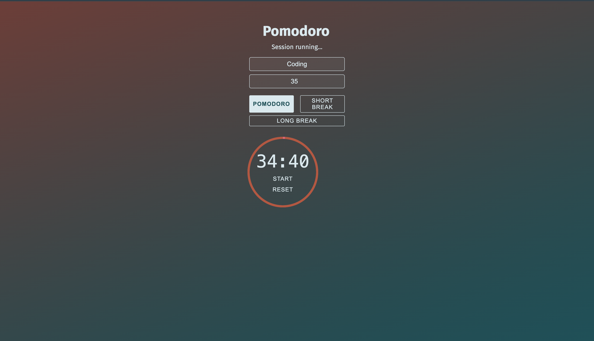

# ⏳ Pomodoro Timer App

A modern, customizable **Pomodoro timer** built using **HTML**, **CSS**, and **JavaScript** — enhanced with smooth animations, session modes, custom duration input, and clean responsive design.

---



## 🎯 What is the Pomodoro Technique?

The Pomodoro Technique is a time management method that helps improve focus and productivity. It divides work into focused intervals (typically 25 minutes), followed by short breaks to rest and recharge.

---

## 🚀 Features

- ⏱️ **Three Timer Modes**
  - Pomodoro (25 minutes)
  - Short Break (5 minutes)
  - Long Break (15 minutes)

- 🧠 **Custom Duration Input** – Enter any focus time

- 🖊️ **Focus Task Field** – Type what you’re working on

- 🔘 **Animated Circular Progress Ring**

- 🔊 **Sound Notification on Completion**

- 💡 **FontAwesome Icons + Smooth Transitions**

- 📱 **Mobile Responsive**

---

## 📂 Project Structure
```
pomodoro-app/
├── index.html
├── style.css
├── app.js
├── sounds/
│ └── preview.mp3
├── README.md
```


---

## 💻 How to Use

### ▶️ Run locally:

```bash
git clone https://github.com/ShashankGoutam/Pomodoro_App.git
cd Pomodoro_App-main
```

Then open index.html in your browser.

💡 For best results, use a local server (e.g., VS Code’s Live Server extension)


## 🌐 Live Demo

🔗 [Click here to try it live](https://shashankgoutam.github.io/Pomodoro_App/)

---

## 🙌 Credits & Tools

- [FontAwesome](https://fontawesome.com) – Icons  
- [Google Fonts](https://fonts.google.com) – Typography  
- [Cool Backgrounds](https://coolbackgrounds.io) – Background inspiration  
- Developed by [Shashank Goutam](https://github.com/ShashankGoutam)
