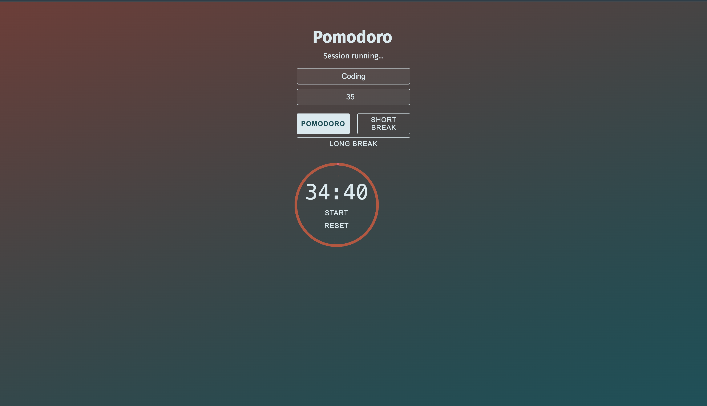

# ⏳ Pomodoro Timer App

A modern, customizable **Pomodoro timer** built using **HTML**, **CSS**, and **JavaScript** with smooth animations, session modes, custom duration input, and responsive UI.

---



## 🎯 What is the Pomodoro Technique?

The Pomodoro Technique is a time management method that helps improve focus and productivity. It divides work into focused intervals (typically 25 minutes), followed by short breaks to rest and recharge.

---

## 🚀 Features

- ⏱️ **Three Timer Modes**
  - Pomodoro (25 minutes)
  - Short Break (5 minutes)
  - Long Break (15 minutes)
- ⏯️ **Start / Pause / Resume / Reset controls**
- 🧠 **Custom Duration Mode**
- 🖊️ **Focus Task Input**
- 🔇 **Mute toggle for alert sound**
- 🔔 **Browser notification on completion** (when permission is granted)
- 💾 **Local persistence** for mode, custom time, focus text, and mute state
- 📱 **Mobile-responsive + accessibility improvements**

## 📂 Project Structure

```text
├── .github/workflows/deploy.yml
└── README.md
## 💻 Run Locally
cd Pomodoro_App
python3 -m http.server 8000
Then open `http://localhost:8000`.
---
## 🚢 Deploy (GitHub Pages)
This repository includes a Pages workflow at `.github/workflows/deploy.yml`.

1. Push to the `main` branch.
2. In GitHub repo settings, ensure **Pages** source is set to **GitHub Actions**.
3. The workflow will publish the site automatically.

- [FontAwesome](https://fontawesome.com) – Icons
- [Google Fonts](https://fonts.google.com) – Typography
- [Cool Backgrounds](https://coolbackgrounds.io) – Background inspiration

```bash
git clone https://github.com/ShashankGoutam/Pomodoro_App.git
cd Pomodoro_App
```

Open `index.html` directly in your browser, or run a static server:

```bash
python3 -m http.server 8000
```

Then visit `http://localhost:8000`.

---

## 🌐 Live Demo

🔗 [Click here to try it live](https://shashankgoutam.github.io/Pomodoro_App/)

---

## 🙌 Credits & Tools

- [FontAwesome](https://fontawesome.com) – Icons
- [Google Fonts](https://fonts.google.com) – Typography
- [Cool Backgrounds](https://coolbackgrounds.io) – Background inspiration
- Developed by [Shashank Goutam](https://github.com/ShashankGoutam)
